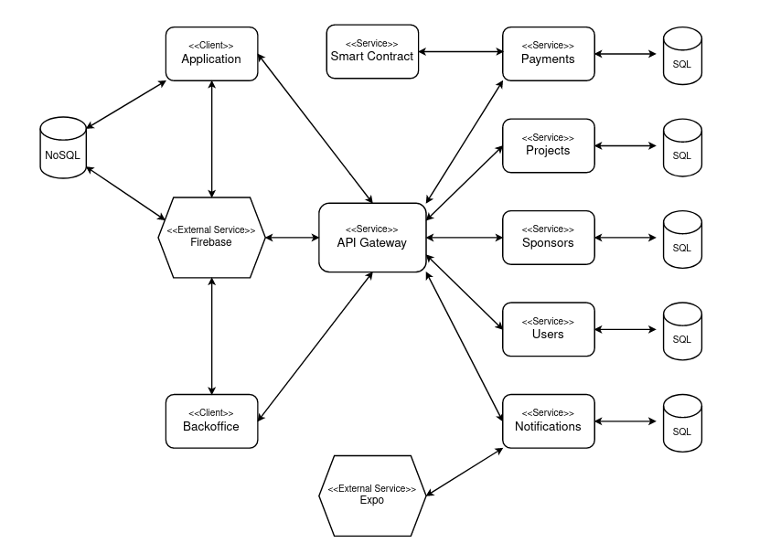

# Arquitectura de la aplicacion

Este manual busca proporcionar informacion tecnica sobre la arquitectura de la aplicacion y cada uno de los servicios internos y externos a ella involucrados

## Backend

El backend cuenta con 6 servicios y un nodo de smart contract que le permiten desempeñar sus funcionalidades. A excepcion del servicio de notificaciones y del smart contract, todos fueron construidos utilizando las mismas tecnologias: Javascript como lenguaje, NodeJS y Express como motor de ejecucion y framework de construccion de la API Rest, PostgreSQL y Sequelize como motor y administrador de base de datos y Jest para la realizacion de tests. El servicio de notificaciones fue implementado utilizando Python como lenguaje, FastAPI como framework de API Rest, SQLAlchemy y PostgreSQL como motor y administrador de base de datos. Por ultimo, el smart contract fue implementado utilizando una base provista por la catedra hecha en Solidity, y probada y testeada sobre  un nodo local de Hardhat.

### API Gateway

Se encarga de proporcionar una interfaz entre los microservicios internos del backend y los clientes. Entre sus tareas se encuentra la autenticacion de las cuentas de los usuarios, la cual se lleva a cabo consumiendo el servicio externo de autenticacion de Firebase haciendo uso de su SDK admin y tokens de autenticacion que son enviados por los clientes en cada una de sus requests, y la orquestacion de los servicios internos.

### Users Service

Se encarga de almacenar los datos de perfil de los usuarios, permitiendo la creacion consulta y modificacion de estos. Juega un rol importante en la validacion de las cuentas de administrador, ya que ademas almacena esta informacion.

### Projects Service

Se encarga de almacenar informacion de los proyectos. Brinda funcionalidades de creacion, modificacion, visualizacion de proyecto y busqueda de proyectos en base a distintos atributos.

### Sponsors Service

Se encarga de almacenar informacion de los historicos de patrocinio y favoritos de cada sponsor a cada proyecto, de cada veedor registrado en el sistema, de cada proyecto que revisiona cada veedor y, por ultimo, cada voto realizado por cada veedor. Esta informacion puede ser consultada, creada y modificada a traves de distintos endpoints que provee.

### Notifications

Su funcion es enviar push notifications a los usuarios a traves de suscripciones de estos a proyectos. Las push notifications se implementaron utilizando el servicio externo de Expo, el cual permite enviar notificaciones a un determinado dispositivo a traves de un token. Para brindar tal funcionalidad debe almacenar una traduccion de userid a token por cada usuario e informacion de las suscripciones de cada usuario a cada proyecto.

### Payments

Su funcion principal es la de gestionar el Smart Contract actuando como punto de entrada al mismo. Cuenta con una base de datos donde almacena las direcciones de las billeteras de los usuarios de SeedyFiuba y la relacion entre la entididad Proyectos y el proyecto representado en el Smart Contract. Esta altamente acomplado con la red de ETH, ya sea una test-net o la real-net.

### Smart Contract

El Smart Contract resulta una pieza fundamental en lo que es la estructura del proyecto. Es la single source of truth del estado de los proyectos, veedores y estados de financiamientos. Se deploya sobre una red de ETH y se interactua con el mismo a traves de una ABI autogenerada. En este proyecto en particular se decidió modificar el Smart Contract original para soportar el voto de veedores, bajo reglas de negocio se necesitan 3 veedores para que el proyecto pase a un estado de financiamiento. Las pruebas correspondientes fueron agregadas para validar el correcto funcionamiento del mismo.

